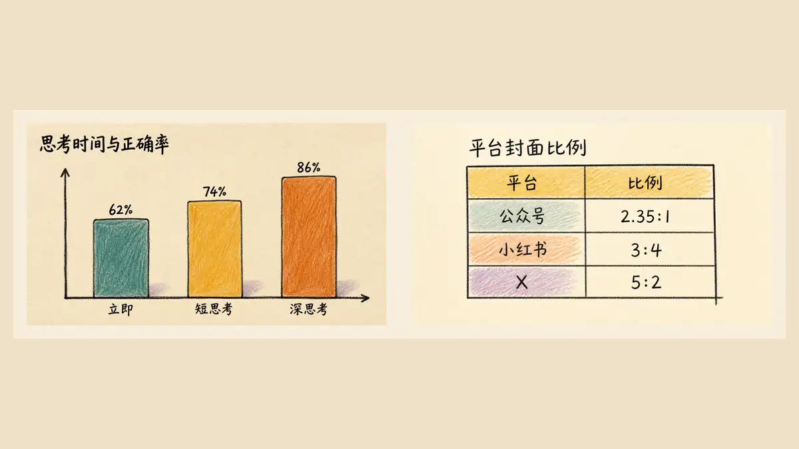

<p align="center">
  
</p>

<h1 align="center">Boluobao</h1>

<p align="center">
  <strong>把文字、图片与数据，重新画成有温度的视觉故事。</strong><br>
  <em>Redraw words, images, and data as warm visual stories.</em>
</p>

<p align="center">
  <a href="https://github.com/xiaomiaode001/boluobao/releases/latest"></a>
  <a href="LICENSE"></a>
  <a href="LICENSES/CC-BY-4.0.txt"></a>
  
  
</p>

<p align="center">
  
</p>

<p align="center">
  <sub><a href="docs/showcase/cover-x-5x2-v1.webp">5:2 超宽封面 / Wide banner</a></sub>
</p>

<p align="center">
  <a href="#中文介绍">中文</a> · <a href="#english-introduction">English</a> ·
  <a href="#能力展示--capability-gallery">Gallery</a> · <a href="#快速开始--quick-start">Quick Start</a> ·
  <a href="#参与贡献--contributing">Contributing</a>
</p>

## 中文介绍

**Boluobao** 是一个兼容 Codex 与 Claude Code 的可调用 Skill，为创作者、自媒体作者、教育工作者与独立团队提供稳定、可复用的风格化视觉设计。它能理解文章结构与叙事核心，自动规划适合配图的段落和最少图片数量；也能生成社媒封面、中英日及多语手写便签、食物与场景插画、人物近景、轻量图表和表格，或将用户提供的照片重构成统一的手账式视觉。

它不是一个只会套滤镜的提示词，而是一套包含内容规划、构图、文字校对、数据保护、质量评分和交付规则的完整工作流。视觉语言由暖色无涂布纸、深色墨线、半透明彩铅、留白、手写批注和受控的不规则感组成。

欢迎内容创作者、社媒用户和设计实践者使用、测试并提出反馈。你可以从一句“为我的内容进行配图”开始，也可以明确指定平台、比例、图片数量或重构模式。

## English Introduction

**Boluobao** is an invokable Skill for Codex and Claude Code, built for creators, social-media publishers, educators, and independent teams who need a consistent, reusable visual language. It reads the structure and narrative core of an article, selects the paragraphs that benefit from illustration, and proposes the smallest useful image set. It can also create multilingual handwritten notes—including Chinese, English, and Japanese—social covers, food and scene illustrations, close-up characters, compact charts and tables, or reconstruct a supplied photograph in a coherent journal-like style.

This is more than a filter prompt. Boluobao combines content planning, composition, text verification, data protection, quality scoring, and delivery rules in one workflow. Its visual language uses warm uncoated paper, dark ink contours, translucent colored pencil, purposeful whitespace, handwritten annotations, and controlled imperfection.

Creators, social-media users, and design practitioners are welcome to use the project, test it, and share feedback. Start with “Create illustrations for my article,” or specify a platform, aspect ratio, image count, or reconstruction mode.

## 创作方向与独立性 / Creative Direction & Independence

本项目的视觉研究受到韩国插画家兼作者 **[이다（2da / Ida）](https://www.yes24.com/product/author/117685)** 以手写、手绘记录日常、观察与旅行的创作观念启发。Boluobao 将“观察、纸感、笔触、留白和手账叙事”抽象为自己的规则系统，并通过金标样张持续校准。

The project was inspired by Korean illustrator and author **[이다 (2da / Ida)](https://www.yes24.com/product/author/117685)** and her practice of recording everyday life, observation, and travel through handwriting and drawing. Boluobao turns the broader ideas of observation, paper texture, visible marks, whitespace, and journal storytelling into an independent rule system calibrated against its own reference set.

> Boluobao is not affiliated with, endorsed by, or an official project of Ida. It does not copy a specific artwork or instruct a model to reproduce the unique style of a living artist. / 本项目与 Ida 不存在官方合作或授权关系，也不复制特定作品或要求模型复刻在世艺术家的独特风格。

## 能力概览 / What It Does

| 能力 / Mode | 中文 | English | 默认 / Default |
|---|---|---|---|
| 文章配图 / Editorial illustration | 识别段落角色、叙事命题与适合配图的位置 | Maps paragraph roles, narrative propositions, and illustration opportunities | `16:9`, 最少必要张数 / minimum useful set |
| 社媒封面 / Social cover | 为公众号、小红书、X 等平台原生重构，不直接裁切同一母版 | Re-composes natively for WeChat, Xiaohongshu, X, and other platforms | 通用 `4:5`; 平台原生比例 / native ratio |
| 手写便签 / Handwritten note | 锁定中英日及多语文字，分别处理中文重心、英文 x-height 与日文假名节奏 | Locks Chinese, English, Japanese, and multilingual copy while preserving each script's own handwritten rhythm | 单页、双语或多语 / single, bilingual, or multilingual |
| 图片重构 / Image reconstruction | 保留主体、身份、姿态、视角与关键空间关系 | Preserves subject, identity, pose, viewpoint, and diagnostic spatial relationships | 依输入与用途 / based on input and use |
| 食物、人物与场景 / Food, people & scenes | 单体食物、制作流程、近景人物、景观与地标 | Single food, process boards, close-up characters, landscapes, and landmarks | 叙事优先 / narrative-first |
| 图表与表格 / Charts & tables | 保护标签、数值、单位、排序、柱高与单元格归属 | Protects labels, values, units, ordering, bar geometry, and cell ownership | 紧凑数据 / compact data only |

## 能力展示 / Capability Gallery

四张能力展示板统一使用 `16:9` 外框。同类型图片放入等宽、等高的卡片区域；原生比例通过留白保留，不裁切、不拉伸。

All four capability boards use the same `16:9` frame. Samples within each category are placed in aligned card areas; native aspect ratios are preserved with whitespace rather than cropping or stretching.

<table>
  <tr>
    <td width="50%"><br><sub><b>中英文便签 / Chinese & English notes</b><br>字宽、重心、倾斜与 x-height 具有自然变化，同时维持可读性。</sub></td>
    <td width="50%"><br><sub><b>社媒封面 / Social covers</b><br>公众号 <code>2.35:1</code>、小红书 <code>3:4</code>、X <code>5:2</code> 原生构图在统一卡片中对齐展示。</sub></td>
  </tr>
  <tr>
    <td width="50%"><br><sub><b>文章配图 / Editorial illustrations</b><br>把“立即回答”与“先想一会”等抽象论点转成清楚的视觉命题。</sub></td>
    <td width="50%"><br><sub><b>图表与表格 / Charts & tables</b><br>保留准确数据和视觉编码，让信息表达也具备统一纸上风格。</sub></td>
  </tr>
</table>

### 多语便签 / Multilingual Note

<p align="center">
  
</p>

<p align="center">
  <sub><b>连接世界各地的 AI 爱好者 / Connecting AI enthusiasts worldwide</b><br>英文、日文与中文在未指定主语言时保持等权层级，以人物、地球和连接线表达交流，不依赖国旗或文化刻板符号。<br>English, Japanese, and Chinese share equal hierarchy when no primary language is named; people, a globe, and connecting paths communicate the idea without flags or cultural stereotypes.</sub>
</p>

## 项目案例 / Project Showcase

以下案例使用“上方原始场景／下方 Boluobao 重构”的方式展示内容保持与视觉重构。8 张案例统一为 `4:5` 外框，均采用无裁切适配。它们用于项目效果说明，不是固定版式或故事模板。

The following cases pair an original scene with a Boluobao reconstruction to demonstrate content preservation and visual transformation. All eight cases use aligned `4:5` frames with no cropping. They demonstrate outcomes rather than prescribe a fixed layout or story template.

### 场景重构 / Scene Reconstruction

<table>
  <tr>
    <td width="50%"><br><sub><b>旧城屋顶傍晚 / Rooftop Evening</b><br>保留人物、晾衣关系、落日与水塔，压缩复杂屋顶噪声。</sub></td>
    <td width="50%"><br><sub><b>海边小站 / Coastal Station</b><br>锁定候车棚、人物、行李箱、弯路与海岸线。</sub></td>
  </tr>
  <tr>
    <td width="50%"><br><sub><b>雨后巷口书店 / Rainy Bookstore</b><br>保留暖光门口、自行车、雨伞人物与积水反光。</sub></td>
    <td width="50%"><br><sub><b>雪后松林小路 / Snowy Pine Road</b><br>用脚印和弯路维持叙事方向，以代表性树群控制密度。</sub></td>
  </tr>
</table>

### 景观重构 / Landscape Reconstruction

<table>
  <tr>
    <td width="50%"><br><sub><b>雾晨梯田 / Misty Terraces</b><br>锁定梯田曲线、人物尺度、山体与晨雾。</sub></td>
    <td width="50%"><br><sub><b>湖边木栈道 / Lakeside Boardwalk</b><br>让栈道成为视觉路线，扩大水面与原纸留白。</sub></td>
  </tr>
</table>

### 食物制作流程 / Food Process Boards

<table>
  <tr>
    <td width="50%"><br><sub><b>菠萝包 / Pineapple Bun</b><br>用不规则流程布局表现和面、发酵、酥皮、覆盖与烘烤。</sub></td>
    <td width="50%"><br><sub><b>红烧牛肉面 / Braised Beef Noodles</b><br>用锅、面与成品碗建立步骤关系，箭头只承担流程。</sub></td>
  </tr>
</table>

> 展示图包含用户提供的原始素材，仅用于项目效果说明；素材范围见 [ASSETS-LICENSE.md](ASSETS-LICENSE.md)。 / Showcase images include user-supplied source material and are provided only to explain project results. See [ASSETS-LICENSE.md](ASSETS-LICENSE.md).

## 工作方式 / How It Works

```text
内容或图片输入 / Content or image
        ↓
叙事与平台规划 / Narrative & platform plan
        ↓
构图和视觉生成 / Composition & visual generation
        ↓
文字、数据与结构校验 / Text, data & structure checks
        ↓
只交付最终成品 / Final artwork only
```

- 正文配图默认 `16:9`；通用社媒封面默认 `4:5`；指定平台时使用原生比例。
- 未指定数量时，选择覆盖叙事所需的最少张数，默认最多 5 张。
- 精确文字采用“生成 → 逐字校对 → 最多一次局部修正”；仍错误时交付无字留白版。
- 每次任务只保留验收后的成品，不在项目输出目录遗留候选稿或修正过程稿。

- Editorial illustrations default to `16:9`; generic social covers default to `4:5`; named platforms use native ratios.
- When no count is given, Boluobao selects the smallest set that covers the narrative, with a default maximum of five images.
- Exact text follows “generate → proofread character by character → at most one local correction”; persistent errors fall back to a text-free layout.
- Only accepted final artwork is retained; candidate and correction files are not left in the task output directory.

## 快速开始 / Quick Start

### Codex

#### 方法一：直接复制到 Codex（推荐） / Paste into Codex (Recommended)

新手不需要先下载 ZIP、打开终端或手动查找 Skills 目录。复制下面的中文指令，直接发送给 Codex：

Beginners do not need to download a ZIP, open a terminal, or locate the Skills directory manually. Copy either prompt below directly into Codex.

```text
请使用内置的 $skill-installer，从 GitHub 仓库 https://github.com/xiaomiaode001/boluobao 的仓库根目录安装 Skill，安装名称保持为 boluobao。目标位置使用当前用户的 $CODEX_HOME/skills；如果没有设置 CODEX_HOME，则使用 ~/.codex/skills。安装前先检查目标目录：如果 boluobao 已经存在，不要覆盖、删除或修改其中内容，只报告当前状态并告诉我安全更新方式。安装完成后验证 SKILL.md，并告诉我从下一轮开始如何使用 $boluobao。
```

English copy-paste prompt:

```text
Use the built-in $skill-installer to install the Skill from the repository root of https://github.com/xiaomiaode001/boluobao, keeping the installed name as boluobao. Install it under the current user's $CODEX_HOME/skills, or ~/.codex/skills when CODEX_HOME is not set. Check the destination first: if boluobao already exists, do not overwrite, delete, or modify it; report its status and explain the safe update path. After installation, validate SKILL.md and tell me how to use $boluobao from the next turn.
```

安装成功后，从下一轮开始可以直接这样调用：

After installation, use it from the next turn with prompts such as:

```text
使用 $boluobao 为这篇文章规划并生成配图。
使用 $boluobao 为我的内容生成社媒封面。
使用 $boluobao 重新设计这张图片，并保留主体关系。
```

如果下一轮仍未显示 Skill，请重新开启一个 Codex 会话。安装过程中如需联网或写入 Skills 目录，Codex 会正常请求你的授权。

If the Skill is not visible on the next turn, start a new Codex session. Codex may ask for approval when network access or a write to the Skills directory is required.

#### 方法二：手动安装 / Manual Installation

如果更习惯终端，可以把仓库浅克隆到 Codex Skills 目录，并确保目录名为 `boluobao`。

If you prefer a terminal, shallow-clone the repository into the Codex Skills directory and keep the folder name `boluobao`.

##### Windows（PowerShell）

```powershell
New-Item -ItemType Directory -Force -Path "$env:USERPROFILE\.codex\skills" | Out-Null
git clone --depth 1 https://github.com/xiaomiaode001/boluobao.git "$env:USERPROFILE\.codex\skills\boluobao"
python -X utf8 "$env:USERPROFILE\.codex\skills\boluobao\scripts\validate_package.py"
```

##### macOS / Linux

```bash
mkdir -p "$HOME/.codex/skills"
git clone --depth 1 https://github.com/xiaomiaode001/boluobao.git "$HOME/.codex/skills/boluobao"
python3 -X utf8 "$HOME/.codex/skills/boluobao/scripts/validate_package.py"
```

如果设置了自定义 `CODEX_HOME`，请把示例中的 `$HOME/.codex` 或 `$env:USERPROFILE\.codex` 替换为该目录。安装后可以直接自然语言调用，也可以显式使用 `$boluobao`。`agents/openai.yaml` 已启用隐式调用并配置菠萝包品牌图标。

If you use a custom `CODEX_HOME`, replace `$HOME/.codex` or `$env:USERPROFILE\.codex` in the examples with that directory. After installation, use natural-language requests or invoke `$boluobao` explicitly. `agents/openai.yaml` enables implicit invocation and configures the pineapple-bun brand icon.

目标目录已存在时不要重复运行 `git clone`，请使用下面的更新命令。

If the target directory already exists, do not run `git clone` again; use the update command below.

更新已安装版本 / Update an existing installation:

```powershell
# Windows PowerShell
git -C "$env:USERPROFILE\.codex\skills\boluobao" pull --ff-only
```

```bash
# macOS / Linux
git -C "$HOME/.codex/skills/boluobao" pull --ff-only
```

Skill 本身不需要 npm、pip 或第三方字体依赖。生成图片时仍需当前 Codex 环境提供可用的图片生成或编辑工具。

The Skill itself requires no npm package, pip package, or third-party font. Pixel generation still requires an image-generation or image-editing tool available in the active Codex environment.

### Claude Code

在仓库根目录启动 Claude Code 时，已提交的 `.claude/skills/boluobao/SKILL.md` 会提供项目级入口；可以直接使用 `/boluobao`，也可以让 Claude Code 根据描述自动调用。这个轻量入口始终读取根目录的主 `SKILL.md`，不会维护第二套画风规则。

When Claude Code starts in the repository root, the committed `.claude/skills/boluobao/SKILL.md` provides a project-scoped entry point. Invoke `/boluobao` directly or let Claude Code select it from the task description. The lightweight bridge always reads the canonical root `SKILL.md`, so there is no second style definition to drift.

如需在所有项目中使用，把当前主包同步到个人 Skills 目录：

For personal use across projects, synchronize the canonical package into the user Skills directory:

```powershell
python -X utf8 scripts/sync_claude_skill.py --install-user
python -X utf8 scripts/sync_claude_skill.py --install-user --check
```

目标目录为 `~/.claude/skills/boluobao/`。每次拉取新版后重新运行第一条命令即可同步；脚本只覆盖自己清单中管理的文件，并拒绝覆盖未受管理的非空目录。如果 Claude Code 启动时还不存在顶层 Skills 目录，首次安装后重启一次会话。

The target is `~/.claude/skills/boluobao/`. Re-run the first command after pulling an update; the synchronizer only overwrites files in its own manifest and refuses unmanaged non-empty targets. If no top-level Skills directory existed when Claude Code started, restart the session once after the first install.

> Claude Code 兼容层不假设特定图像服务。实际生成图片需要当前 Claude Code 环境配置可用的图像生成或编辑工具；没有像素生成工具时，Skill 仍会完成内容映射、构图、锁定文字、生产提示和校验方案，但不会声称已生成文件。
>
> The Claude Code adapter is tool-neutral. Pixel output requires an image-generation or image-editing tool configured in the current Claude Code environment. Without one, the Skill still completes the content map, composition, locked text, production prompt, and verification plan, but never claims that an image file was generated.

```text
为我的内容进行配图。
Create illustrations for my article.

为这篇文章生成公众号、小红书和 X 封面。
Create native WeChat, Xiaohongshu, and X covers for this article.

帮我将这个图片用 boluobao 进行设计。
Redesign this image with boluobao while preserving its subject and composition.

用 boluobao 把这些数据做成柱状图和紧凑表格。
Turn this data into a boluobao bar chart and compact table.

用 boluobao 创作一张中英日三语便签，未指定主语言时让三种文字等权呈现。
Create a Chinese-English-Japanese note with equal language hierarchy using boluobao.
```

文字配图任务会先给出内容角色、建议张数、每张叙事命题、比例与短文字锁定。最终交付包含段落映射、尺寸、文字或数据校验状态、质量评分和绝对文件路径。

For editorial work, Boluobao first returns content roles, a recommended image count, a narrative proposition for each image, aspect ratios, and locked short text. Final delivery includes paragraph mapping, dimensions, text or data verification status, quality score, and absolute file paths.

## 质量边界 / Quality Boundaries

- 暖纸、深色手绘轮廓、半透明彩铅和局部安全的不规则感是稳定视觉基因。
- 数据、单位、排序、几何编码与单元格关系不可作为“错误感”素材。
- 不适用于写实修图、干净矢量稿、密集电子表格或未经授权的特定艺术家模仿。
- 金标模式目标 `19/20`；仍在校准的模式最低 `18/20`；任何交付不得低于 `17/20`。

- Warm paper, dark hand-drawn contours, translucent colored pencil, and locally safe irregularity form the stable visual DNA.
- Values, units, order, geometric encodings, and cell ownership are never treated as material for intentional imperfection.
- The Skill is not intended for photorealistic retouching, clean vector artwork, dense spreadsheets, or unauthorized imitation of a named artist.
- Gold modes target `19/20`; calibrating modes target at least `18/20`; no deliverable may score below `17/20`.

Detailed rules: [SKILL.md](SKILL.md) · [Style DNA](references/style-dna.md) · [Quality rubric](references/quality-rubric.md) · [Charts and tables](references/data-chart-and-table-recipes.md)

## 验证 / Validation

```powershell
python -X utf8 scripts/validate_package.py
python -X utf8 scripts/sync_claude_skill.py --target "$env:TEMP/boluobao" --dry-run
```

The validator checks rule references, gold samples, image dimensions and hashes, invocation cases, aligned GitHub showcase ratios, brand resources, the Claude Code bridge and synchronizer, duplicate images, forbidden artifact directories, and the 60 MB package limit.

## 项目结构 / Repository Structure

```text
boluobao/
├── SKILL.md                  # Skill entry point / 入口规则
├── .claude/skills/boluobao/  # Claude Code project bridge
├── agents/openai.yaml        # UI metadata and invocation policy
├── assets/
│   ├── brand/                # Pineapple-bun brand icon
│   ├── references/           # Original style references
│   └── tests/                # Gold and structural baselines
├── docs/showcase/            # Lightweight GitHub previews
├── references/               # Mode-specific rules and quality gates
├── scripts/                  # Archive, validation, and Claude sync tools
├── ASSETS-LICENSE.md         # Asset-specific licensing boundaries
├── CONTRIBUTING.md           # Contributor workflow and review boundaries
├── CHANGELOG.md
└── LICENSE
```

## 参与贡献 / Contributing

欢迎提交可复现的调用回归、针对性规则修正、校验与跨平台改进，以及安装、翻译和可访问性文档。涉及新模式、共享画风规则、依赖或素材授权的变更，请先创建 Issue。完整流程、测试命令、素材边界和 PR 检查清单见 [CONTRIBUTING.md](CONTRIBUTING.md)。

Reproducible invocation regressions, focused rule corrections, validation and cross-platform improvements, and installation, translation, or accessibility documentation are welcome. Open an issue first for changes involving a new mode, shared style rule, dependency, or asset license. See [CONTRIBUTING.md](CONTRIBUTING.md) for the full workflow, tests, asset boundaries, and pull-request checklist.

## 许可证 / Licensing

- Skills 规则、脚本、配置和项目原创文档： [Apache License 2.0](LICENSE)。
- `assets/tests/` 中的生成测试图： [CC BY 4.0](LICENSES/CC-BY-4.0.txt)。
- 菠萝包名称、品牌图标和 `assets/brand/`：保留所有权。
- `docs/showcase/`：仅用于项目效果展示，不授权独立提取或复用。
- `assets/references/`：不包含在开源授权中；具体范围见 [ASSETS-LICENSE.md](ASSETS-LICENSE.md)。

- Skill rules, scripts, configuration, and original project documentation: [Apache License 2.0](LICENSE).
- Generated test images in `assets/tests/`: [CC BY 4.0](LICENSES/CC-BY-4.0.txt).
- The Boluobao name, brand icon, and `assets/brand/`: all rights reserved.
- `docs/showcase/`: display-only; no standalone extraction or reuse is granted.
- `assets/references/`: excluded from the open-source grant; see [ASSETS-LICENSE.md](ASSETS-LICENSE.md).

## 欢迎使用与反馈 / Welcome & Feedback

欢迎创作者、社媒运营者、教育工作者和独立开发者使用 Boluobao。真实调用中若出现可稳定复现的问题，欢迎提交 Issue，并附上输入类型、目标平台或比例、期望结果及实际结果。项目已进入稳定维护阶段，不再为单次生成事故累积通用规则，只针对可复现回归进行更新。

Creators, social-media publishers, educators, and independent developers are welcome to use Boluobao. If a real invocation exposes a reproducible issue, please open an Issue with the input type, target platform or ratio, expected result, and actual result. The project is now in stable maintenance: general rules are updated only for reproducible regressions rather than one-off generation accidents.
