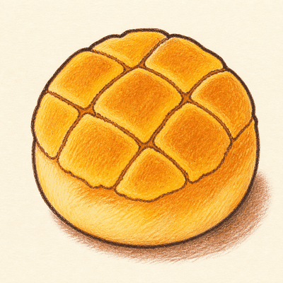
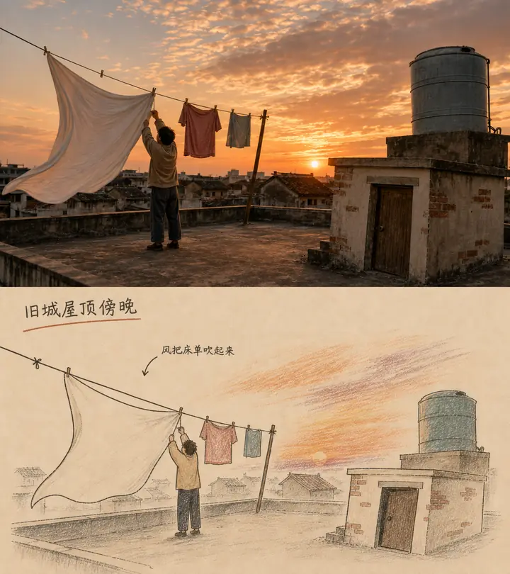
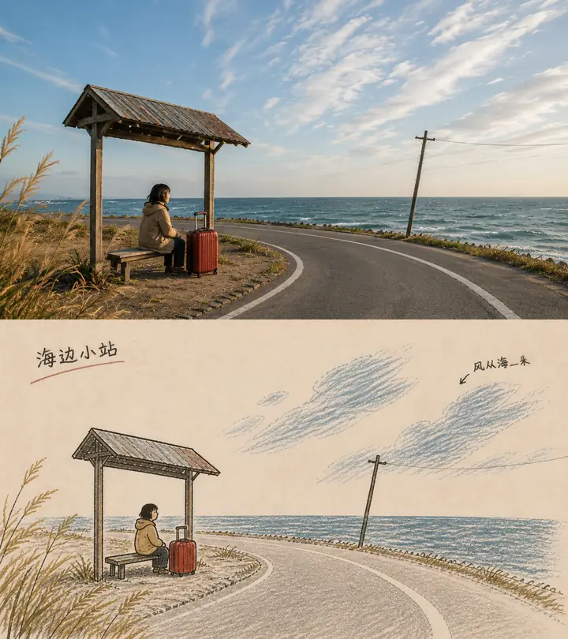
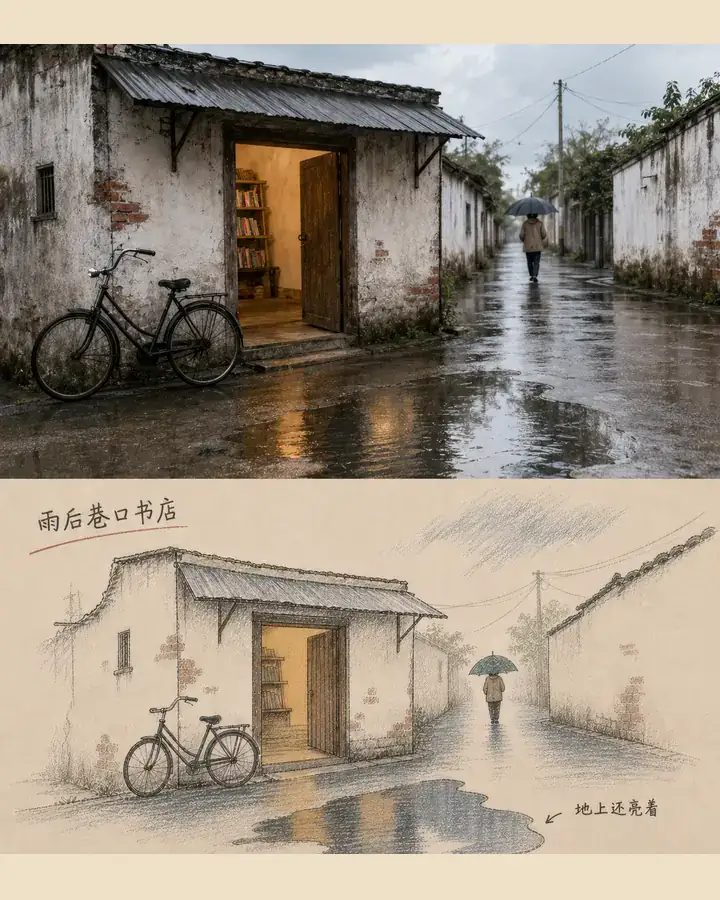
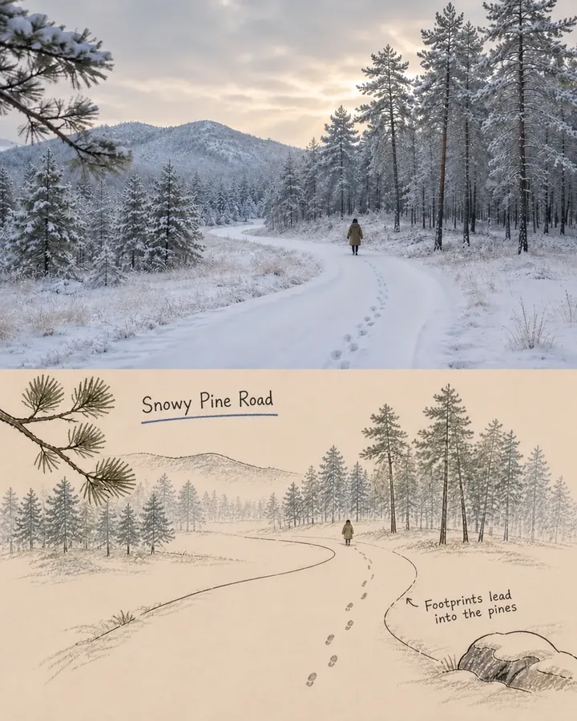
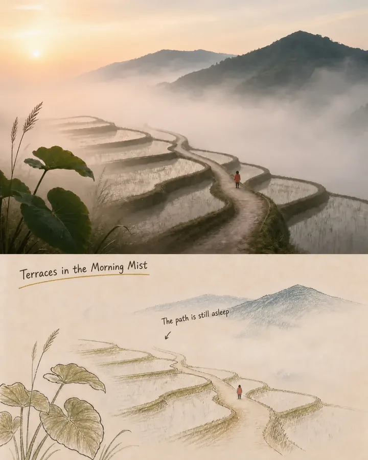
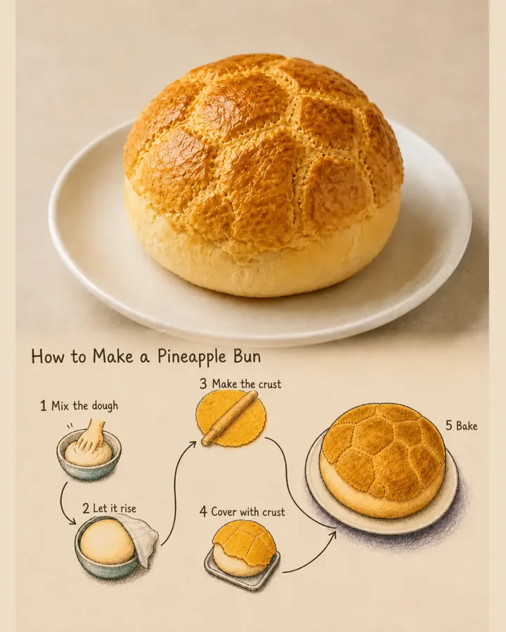
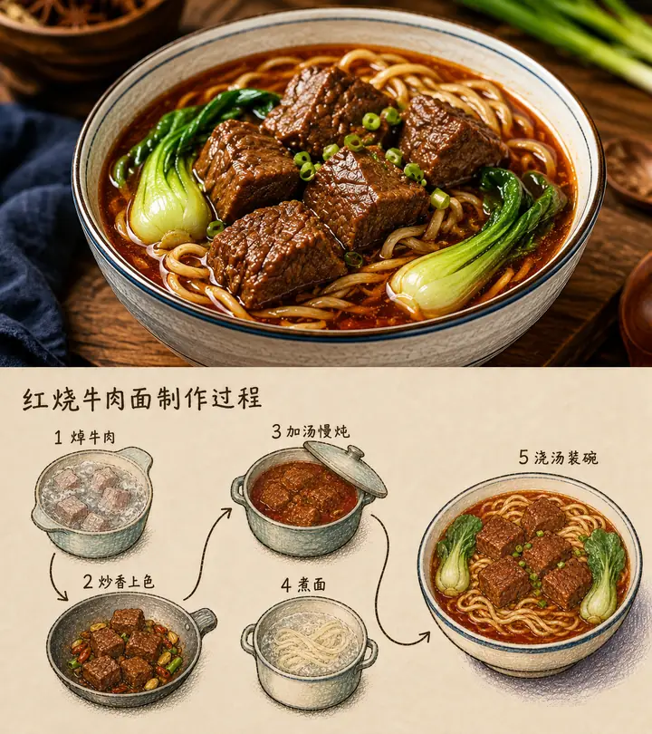

<p align="center">
  
</p>

<h1 align="center">Boluobao</h1>

<p align="center">把文字、数据或图片重构成暖纸、墨线和彩铅组成的手账式视觉。</p>

`Boluobao` 是一个可隐式调用的 Codex Skill。它能从文章中自动选择适合配图的段落，规划最少但足够的图片数量，生成社媒封面和文章配图，也能重构用户提供的图片，并制作小型柱状图或表格。

当前稳定版本：**v1.1.0**。核心包包含 8 张原始风格参考、21 张金标或结构基线以及机器校验脚本，完整包体保持在 60 MB 以内。

## 能力

- 文章配图规划：分析论点和段落角色，默认输出 `16:9` 配图。
- 社媒封面：未指定平台时使用 `4:5`；指定平台时原生重构，而不是裁切同一母版。
- 图片风格重构：保留主体数量、身份、姿态、视角和诊断性结构。
- 食物、人物、场景、景观、地标、手稿与中英文手写便签。
- 紧凑数据图：保护标签、数值、单位、顺序、柱高关系及单元格归属。
- 最终成品制：项目目录只保留验收后的最终文件，不交付候选稿和修正过程稿。

## 调用示例

```text
为我的内容进行配图。
为这篇文章生成社媒封面。
帮我将这个图片用 boluobao 进行设计。
用 boluobao 把这些数据做成柱状图。
用 boluobao 做一张平台和封面比例表格。
```

也可以显式使用 `$boluobao`。当输入是文章时，Skill 会先返回段落角色、叙事命题、建议张数、短文字和比例；最终交付包含尺寸、文字或数据校验状态、质量评分及绝对路径。

## 效果展示与说明

以下案例使用“上方原始场景／下方 Boluobao 重构”的方式展示内容保持与视觉重构。它们是项目效果说明，不作为模型要复制的版式或故事模板。

### 场景重构

<table>
  <tr>
    <td width="50%"><br><sub><b>旧城屋顶傍晚</b>：保留人物、晾衣关系、落日和水塔，把复杂屋顶压缩为可读的手账场景。</sub></td>
    <td width="50%"><br><sub><b>海边小站</b>：锁定候车棚、人物、行李箱、弯路和海岸线，以留白和稀疏色块重建空间。</sub></td>
  </tr>
  <tr>
    <td width="50%"><br><sub><b>雨后巷口书店</b>：保留暖光门口、自行车、雨伞人物和积水反光，弱化墙体噪声。</sub></td>
    <td width="50%"><br><sub><b>雪后松林小路</b>：使用脚印和弯路维持叙事方向，以代表性树群代替逐棵描绘。</sub></td>
  </tr>
</table>

### 景观重构

<table>
  <tr>
    <td width="50%"><br><sub><b>雾晨梯田</b>：锁定梯田曲线、人物尺度、山体与晨雾，减少自然表面的完整填充。</sub></td>
    <td width="50%"><br><sub><b>湖边木栈道</b>：让栈道成为视觉路线，保留远山、人物和水面光带，扩大原纸留白。</sub></td>
  </tr>
</table>

### 食物制作流程

<table>
  <tr>
    <td width="50%"><br><sub><b>菠萝包</b>：用不规则流程布局表现和面、发酵、酥皮、覆盖与烘烤，并保持成品为主视觉。</sub></td>
    <td width="50%"><br><sub><b>红烧牛肉面</b>：用锅、面和成品碗建立步骤关系，箭头仅承担流程，不制造额外说明。</sub></td>
  </tr>
</table>

> 展示图包含用户提供的原始素材。公开发布或用于商业页面前，请确认相应素材的展示与再发布授权。

## 设计边界

- 暖色无涂布纸、深色手绘轮廓、半透明彩铅和局部安全的不规则感是稳定视觉基因。
- 文字最多进行一次局部修正；仍不可靠时返回无字留白版，不引入第三方字体依赖。
- 图表和表格中的数值、单位、排序、几何编码及单元格关系不可作为“错误感”素材。
- 不适用于写实修图、干净矢量稿、密集电子表格或未经授权的特定艺术家模仿。

详细规则见 [SKILL.md](SKILL.md)，图表与表格规则见 [data-chart-and-table-recipes.md](references/data-chart-and-table-recipes.md)。

## 安装

将整个仓库克隆或复制到 Codex Skills 目录，并确保目录名为 `boluobao`：

```text
~/.codex/skills/boluobao/
```

安装后可以直接使用自然语言调用，也可以显式输入 `$boluobao`。仓库中的 `agents/openai.yaml` 已启用隐式调用并配置菠萝包品牌图标。

## 许可证

本仓库采用分层授权：

- Skills 规则、脚本、配置和项目原创文档采用 [Apache License 2.0](LICENSE)。
- `assets/tests/` 中的生成测试图采用 [CC BY 4.0](LICENSES/CC-BY-4.0.txt)。
- 菠萝包名称、品牌图标和 `assets/brand/` 保留所有权。
- `docs/showcase/` 仅用于项目效果展示，不授权独立提取或复用。
- `assets/references/` 不包含在开源授权中；公开发布前必须确认每张图片的再分发权限，无法确认的素材应移除或替换。

完整范围和素材条款见 [ASSETS-LICENSE.md](ASSETS-LICENSE.md)。

## 验证

在仓库根目录运行：

```powershell
python -X utf8 scripts/validate_package.py
```

校验内容包括规则引用、金标样张、图片比例和哈希、调用矩阵、品牌资源、展示资源、重复图片、禁用目录及 60 MB 包体上限。

## 仓库结构

```text
boluobao/
├── SKILL.md
├── agents/openai.yaml
├── assets/
│   ├── brand/
│   ├── references/
│   └── tests/
├── docs/showcase/
├── references/
└── scripts/
```

本项目进入稳定维护阶段：不再为单次生成事故累积通用规则，只修复能够在真实调用中稳定复现的回归问题。
